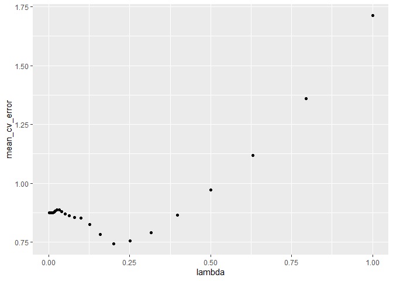

hw5
================
2022-12-01

``` r
library(tidyverse)
library(patchwork)
library(modelr)
library(leaps)
library(purrr)
library(glmnet)
library(knitr)
```

``` r
state= state.x77 %>%
  as.tibble()%>%
  janitor::clean_names()%>%
  select(life_exp,everything()) 
```

## a)

``` r
sum = function(variable){
  tibble(
    mean = mean(variable),
    sd = sd(variable),
    median = median(variable),
    maximum = max(variable),
    minimum = min(variable),
    IQR = IQR(variable)
  )
}

map(state, sum) %>% 
  bind_rows() %>% 
  mutate(variable = names(state)) %>% 
  select(variable,everything()) %>%
  knitr::kable(digits = 2, 
               caption = "Descriptive statistics of continuous variables")
```

| variable   |     mean |       sd |   median |  maximum | minimum |      IQR |
|:-----------|---------:|---------:|---------:|---------:|--------:|---------:|
| life_exp   |    70.88 |     1.34 |    70.67 |     73.6 |   67.96 |     1.78 |
| population |  4246.42 |  4464.49 |  2838.50 |  21198.0 |  365.00 |  3889.00 |
| income     |  4435.80 |   614.47 |  4519.00 |   6315.0 | 3098.00 |   820.75 |
| illiteracy |     1.17 |     0.61 |     0.95 |      2.8 |    0.50 |     0.95 |
| murder     |     7.38 |     3.69 |     6.85 |     15.1 |    1.40 |     6.32 |
| hs_grad    |    53.11 |     8.08 |    53.25 |     67.3 |   37.80 |    11.10 |
| frost      |   104.46 |    51.98 |   114.50 |    188.0 |    0.00 |    73.50 |
| area       | 70735.88 | 85327.30 | 54277.00 | 566432.0 | 1049.00 | 44177.25 |

Descriptive statistics of continuous variables

## b)

``` r
plot(state)
```

<!-- -->

``` r
cor(state) %>%
  knitr::kable(digits=2,caption="Correlation for all variables")
```

|            | life_exp | population | income | illiteracy | murder | hs_grad | frost |  area |
|:-----------|---------:|-----------:|-------:|-----------:|-------:|--------:|------:|------:|
| life_exp   |     1.00 |      -0.07 |   0.34 |      -0.59 |  -0.78 |    0.58 |  0.26 | -0.11 |
| population |    -0.07 |       1.00 |   0.21 |       0.11 |   0.34 |   -0.10 | -0.33 |  0.02 |
| income     |     0.34 |       0.21 |   1.00 |      -0.44 |  -0.23 |    0.62 |  0.23 |  0.36 |
| illiteracy |    -0.59 |       0.11 |  -0.44 |       1.00 |   0.70 |   -0.66 | -0.67 |  0.08 |
| murder     |    -0.78 |       0.34 |  -0.23 |       0.70 |   1.00 |   -0.49 | -0.54 |  0.23 |
| hs_grad    |     0.58 |      -0.10 |   0.62 |      -0.66 |  -0.49 |    1.00 |  0.37 |  0.33 |
| frost      |     0.26 |      -0.33 |   0.23 |      -0.67 |  -0.54 |    0.37 |  1.00 |  0.06 |
| area       |    -0.11 |       0.02 |   0.36 |       0.08 |   0.23 |    0.33 |  0.06 |  1.00 |

Correlation for all variables

``` r
state%>% select(-life_exp)%>%
  funModeling::plot_num()
```

<!-- -->

From the above plot, we can see that population and area are skewed,
while all other variables are pretty normal distributed. We would want
to try to make transformations on population and area.

``` r
ggl_p = 
state %>% 
  mutate(population = log(population)) %>% 
 ggplot(aes(x=population,y=..density..))+
 geom_histogram()+
 geom_line(stat = 'density')+
    labs(x = "population")
ggl_p
```

<!-- -->

``` r
ggl_a=state %>%
  mutate(area = log(area)) %>% 
 ggplot(aes(x=area,..density..))+
 geom_histogram()+geom_line(stat = 'density')+
    labs(x = "area")
ggl_p+ggl_a
```

<!-- -->

``` r
multi.fit=lm(life_exp ~ ., data = state) 
summary(multi.fit)
```

    ## 
    ## Call:
    ## lm(formula = life_exp ~ ., data = state)
    ## 
    ## Residuals:
    ##      Min       1Q   Median       3Q      Max 
    ## -1.48895 -0.51232 -0.02747  0.57002  1.49447 
    ## 
    ## Coefficients:
    ##               Estimate Std. Error t value Pr(>|t|)    
    ## (Intercept)  7.094e+01  1.748e+00  40.586  < 2e-16 ***
    ## population   5.180e-05  2.919e-05   1.775   0.0832 .  
    ## income      -2.180e-05  2.444e-04  -0.089   0.9293    
    ## illiteracy   3.382e-02  3.663e-01   0.092   0.9269    
    ## murder      -3.011e-01  4.662e-02  -6.459 8.68e-08 ***
    ## hs_grad      4.893e-02  2.332e-02   2.098   0.0420 *  
    ## frost       -5.735e-03  3.143e-03  -1.825   0.0752 .  
    ## area        -7.383e-08  1.668e-06  -0.044   0.9649    
    ## ---
    ## Signif. codes:  0 '***' 0.001 '**' 0.01 '*' 0.05 '.' 0.1 ' ' 1
    ## 
    ## Residual standard error: 0.7448 on 42 degrees of freedom
    ## Multiple R-squared:  0.7362, Adjusted R-squared:  0.6922 
    ## F-statistic: 16.74 on 7 and 42 DF,  p-value: 2.534e-10

1)  **Method I: Backward elimination**

By looking at the summary of full model regression, backward elimination
starts eliminating the one with largest p value, we stop remove
variables when their p-value are all less than 0.05. so we **remove
area** first

``` r
step1 <- update(multi.fit, . ~ . -area)
summary(step1)
```

    ## 
    ## Call:
    ## lm(formula = life_exp ~ population + income + illiteracy + murder + 
    ##     hs_grad + frost, data = state)
    ## 
    ## Residuals:
    ##      Min       1Q   Median       3Q      Max 
    ## -1.49047 -0.52533 -0.02546  0.57160  1.50374 
    ## 
    ## Coefficients:
    ##               Estimate Std. Error t value Pr(>|t|)    
    ## (Intercept)  7.099e+01  1.387e+00  51.165  < 2e-16 ***
    ## population   5.188e-05  2.879e-05   1.802   0.0785 .  
    ## income      -2.444e-05  2.343e-04  -0.104   0.9174    
    ## illiteracy   2.846e-02  3.416e-01   0.083   0.9340    
    ## murder      -3.018e-01  4.334e-02  -6.963 1.45e-08 ***
    ## hs_grad      4.847e-02  2.067e-02   2.345   0.0237 *  
    ## frost       -5.776e-03  2.970e-03  -1.945   0.0584 .  
    ## ---
    ## Signif. codes:  0 '***' 0.001 '**' 0.01 '*' 0.05 '.' 0.1 ' ' 1
    ## 
    ## Residual standard error: 0.7361 on 43 degrees of freedom
    ## Multiple R-squared:  0.7361, Adjusted R-squared:  0.6993 
    ## F-statistic: 19.99 on 6 and 43 DF,  p-value: 5.362e-11

Then we **remove illiteracy**

``` r
step2 <- update(step1, . ~ . -illiteracy)
summary(step2)
```

    ## 
    ## Call:
    ## lm(formula = life_exp ~ population + income + murder + hs_grad + 
    ##     frost, data = state)
    ## 
    ## Residuals:
    ##     Min      1Q  Median      3Q     Max 
    ## -1.4892 -0.5122 -0.0329  0.5645  1.5166 
    ## 
    ## Coefficients:
    ##               Estimate Std. Error t value Pr(>|t|)    
    ## (Intercept)  7.107e+01  1.029e+00  69.067  < 2e-16 ***
    ## population   5.115e-05  2.709e-05   1.888   0.0657 .  
    ## income      -2.477e-05  2.316e-04  -0.107   0.9153    
    ## murder      -3.000e-01  3.704e-02  -8.099 2.91e-10 ***
    ## hs_grad      4.776e-02  1.859e-02   2.569   0.0137 *  
    ## frost       -5.910e-03  2.468e-03  -2.395   0.0210 *  
    ## ---
    ## Signif. codes:  0 '***' 0.001 '**' 0.01 '*' 0.05 '.' 0.1 ' ' 1
    ## 
    ## Residual standard error: 0.7277 on 44 degrees of freedom
    ## Multiple R-squared:  0.7361, Adjusted R-squared:  0.7061 
    ## F-statistic: 24.55 on 5 and 44 DF,  p-value: 1.019e-11

Then we **remove income**

``` r
step3 <- update(step2, . ~ . -income)
summary(step3)
```

    ## 
    ## Call:
    ## lm(formula = life_exp ~ population + murder + hs_grad + frost, 
    ##     data = state)
    ## 
    ## Residuals:
    ##      Min       1Q   Median       3Q      Max 
    ## -1.47095 -0.53464 -0.03701  0.57621  1.50683 
    ## 
    ## Coefficients:
    ##               Estimate Std. Error t value Pr(>|t|)    
    ## (Intercept)  7.103e+01  9.529e-01  74.542  < 2e-16 ***
    ## population   5.014e-05  2.512e-05   1.996  0.05201 .  
    ## murder      -3.001e-01  3.661e-02  -8.199 1.77e-10 ***
    ## hs_grad      4.658e-02  1.483e-02   3.142  0.00297 ** 
    ## frost       -5.943e-03  2.421e-03  -2.455  0.01802 *  
    ## ---
    ## Signif. codes:  0 '***' 0.001 '**' 0.01 '*' 0.05 '.' 0.1 ' ' 1
    ## 
    ## Residual standard error: 0.7197 on 45 degrees of freedom
    ## Multiple R-squared:  0.736,  Adjusted R-squared:  0.7126 
    ## F-statistic: 31.37 on 4 and 45 DF,  p-value: 1.696e-12

Then we **population**

``` r
step4 <- update(step2, . ~ . -population)
summary(step4)
```

    ## 
    ## Call:
    ## lm(formula = life_exp ~ income + murder + hs_grad + frost, data = state)
    ## 
    ## Residuals:
    ##      Min       1Q   Median       3Q      Max 
    ## -1.40443 -0.53191  0.07086  0.59086  1.20543 
    ## 
    ## Coefficients:
    ##               Estimate Std. Error t value Pr(>|t|)    
    ## (Intercept) 70.8367894  1.0504710  67.433  < 2e-16 ***
    ## income       0.0001274  0.0002232   0.571  0.57103    
    ## murder      -0.2855582  0.0372605  -7.664 1.07e-09 ***
    ## hs_grad      0.0435538  0.0189754   2.295  0.02643 *  
    ## frost       -0.0069835  0.0024688  -2.829  0.00696 ** 
    ## ---
    ## Signif. codes:  0 '***' 0.001 '**' 0.01 '*' 0.05 '.' 0.1 ' ' 1
    ## 
    ## Residual standard error: 0.7482 on 45 degrees of freedom
    ## Multiple R-squared:  0.7147, Adjusted R-squared:  0.6894 
    ## F-statistic: 28.19 on 4 and 45 DF,  p-value: 9.46e-12

But population creates a better fit for the model, since the adjusted r
square decreased a little after removing population, so I choose to keep
population in the model.

**Result**: backward selection model is

life expectancy = 71 + 0.00005population - 0.3Murder + 0.047hs_grad -
0.006frost

2)  **Method II: Forward elimination**

``` r
variable=names(state)

map(.x=variable,~lm(substitute(life_exp ~ i, list(i = as.name(.x))), data = state)) %>%
  map_df(.,broom::tidy)%>%
  filter(term!="(Intercept)") %>%
  select(term,p.value)%>%
  arrange(p.value)
```

    ## # A tibble: 7 × 2
    ##   term        p.value
    ##   <chr>         <dbl>
    ## 1 murder     2.26e-11
    ## 2 illiteracy 6.97e- 6
    ## 3 hs_grad    9.20e- 6
    ## 4 income     1.56e- 2
    ## 5 frost      6.60e- 2
    ## 6 area       4.58e- 1
    ## 7 population 6.39e- 1

So we first enter the one with the lowest p-value 2.26e-11 \< 0.05:
`murder`.

``` r
forward1 = lm(life_exp ~ murder, data = state) 
summary(forward1)
```

    ## 
    ## Call:
    ## lm(formula = life_exp ~ murder, data = state)
    ## 
    ## Residuals:
    ##      Min       1Q   Median       3Q      Max 
    ## -1.81690 -0.48139  0.09591  0.39769  2.38691 
    ## 
    ## Coefficients:
    ##             Estimate Std. Error t value Pr(>|t|)    
    ## (Intercept) 72.97356    0.26997  270.30  < 2e-16 ***
    ## murder      -0.28395    0.03279   -8.66 2.26e-11 ***
    ## ---
    ## Signif. codes:  0 '***' 0.001 '**' 0.01 '*' 0.05 '.' 0.1 ' ' 1
    ## 
    ## Residual standard error: 0.8473 on 48 degrees of freedom
    ## Multiple R-squared:  0.6097, Adjusted R-squared:  0.6016 
    ## F-statistic: 74.99 on 1 and 48 DF,  p-value: 2.26e-11

``` r
variable=names(state)
map(.x = variable, ~update(forward1, substitute(.~. + i, list(i = as.name(.x))))) %>% 
  map_df(., broom::tidy) %>% 
  filter(term != "(Intercept)", term != "murder") %>% 
  select(term,p.value) %>%
  arrange(p.value)
```

    ## # A tibble: 6 × 2
    ##   term       p.value
    ##   <chr>        <dbl>
    ## 1 hs_grad    0.00909
    ## 2 population 0.0164 
    ## 3 frost      0.0352 
    ## 4 income     0.0666 
    ## 5 area       0.424  
    ## 6 illiteracy 0.543

Enter the one with the lowest p-value 0.00909: `hs_grad`.

``` r
forward2 <- update(forward1, . ~ . + hs_grad)
summary(forward2)
```

    ## 
    ## Call:
    ## lm(formula = life_exp ~ murder + hs_grad, data = state)
    ## 
    ## Residuals:
    ##      Min       1Q   Median       3Q      Max 
    ## -1.66758 -0.41801  0.05602  0.55913  2.05625 
    ## 
    ## Coefficients:
    ##             Estimate Std. Error t value Pr(>|t|)    
    ## (Intercept) 70.29708    1.01567  69.213  < 2e-16 ***
    ## murder      -0.23709    0.03529  -6.719 2.18e-08 ***
    ## hs_grad      0.04389    0.01613   2.721  0.00909 ** 
    ## ---
    ## Signif. codes:  0 '***' 0.001 '**' 0.01 '*' 0.05 '.' 0.1 ' ' 1
    ## 
    ## Residual standard error: 0.7959 on 47 degrees of freedom
    ## Multiple R-squared:  0.6628, Adjusted R-squared:  0.6485 
    ## F-statistic:  46.2 on 2 and 47 DF,  p-value: 8.016e-12

``` r
variable=names(state)
map(.x = variable, ~update(forward2, substitute(.~. + i, list(i = as.name(.x))))) %>% 
  map_df(., broom::tidy) %>% 
  filter(term != "(Intercept)", term != "murder",term!="hs_grad") %>% 
  arrange(p.value)
```

    ## # A tibble: 5 × 5
    ##   term          estimate  std.error statistic p.value
    ##   <chr>            <dbl>      <dbl>     <dbl>   <dbl>
    ## 1 frost      -0.00691    0.00245       -2.82  0.00699
    ## 2 population  0.0000625  0.0000259      2.41  0.0199 
    ## 3 illiteracy  0.254      0.305          0.833 0.409  
    ## 4 area       -0.00000106 0.00000162    -0.658 0.514  
    ## 5 income      0.0000953  0.000239       0.398 0.692

Enter the one with the lowest p-value 0.00699: `frost`.

``` r
forward3 <- update(forward2, . ~ . + frost) 
summary(forward3)
```

    ## 
    ## Call:
    ## lm(formula = life_exp ~ murder + hs_grad + frost, data = state)
    ## 
    ## Residuals:
    ##     Min      1Q  Median      3Q     Max 
    ## -1.5015 -0.5391  0.1014  0.5921  1.2268 
    ## 
    ## Coefficients:
    ##              Estimate Std. Error t value Pr(>|t|)    
    ## (Intercept) 71.036379   0.983262  72.246  < 2e-16 ***
    ## murder      -0.283065   0.036731  -7.706 8.04e-10 ***
    ## hs_grad      0.049949   0.015201   3.286  0.00195 ** 
    ## frost       -0.006912   0.002447  -2.824  0.00699 ** 
    ## ---
    ## Signif. codes:  0 '***' 0.001 '**' 0.01 '*' 0.05 '.' 0.1 ' ' 1
    ## 
    ## Residual standard error: 0.7427 on 46 degrees of freedom
    ## Multiple R-squared:  0.7127, Adjusted R-squared:  0.6939 
    ## F-statistic: 38.03 on 3 and 46 DF,  p-value: 1.634e-12

``` r
variable=names(state)
map(.x = variable, ~update(forward3, substitute(.~. + i, list(i = as.name(.x))))) %>% 
  map_df(., broom::tidy) %>% 
  filter(term != "(Intercept)", term != "murder",term!="hs_grad",term!="frost") %>% 
  arrange(p.value)
```

    ## # A tibble: 4 × 5
    ##   term           estimate  std.error statistic p.value
    ##   <chr>             <dbl>      <dbl>     <dbl>   <dbl>
    ## 1 population  0.0000501   0.0000251      2.00   0.0520
    ## 2 income      0.000127    0.000223       0.571  0.571 
    ## 3 illiteracy -0.182       0.328         -0.554  0.582 
    ## 4 area       -0.000000329 0.00000154    -0.214  0.832

P-value of all new added variables are larger than 0.05, which means
that they are not significant predictor, so we stop here.

``` r
forward_fit = lm(life_exp ~ murder + hs_grad + frost, data = state) %>%
summary() %>% broom::tidy()
```

The model we obtained by forward elimination is life_exp \~ murder +
hs_grad + frost.

**Method III: stepwise regression**

``` r
step.fit <- lm(life_exp ~ ., data = state)
step(step.fit, direction = 'both') # select by AIC 
```

    ## Start:  AIC=-22.18
    ## life_exp ~ population + income + illiteracy + murder + hs_grad + 
    ##     frost + area
    ## 
    ##              Df Sum of Sq    RSS     AIC
    ## - area        1    0.0011 23.298 -24.182
    ## - income      1    0.0044 23.302 -24.175
    ## - illiteracy  1    0.0047 23.302 -24.174
    ## <none>                    23.297 -22.185
    ## - population  1    1.7472 25.044 -20.569
    ## - frost       1    1.8466 25.144 -20.371
    ## - hs_grad     1    2.4413 25.738 -19.202
    ## - murder      1   23.1411 46.438  10.305
    ## 
    ## Step:  AIC=-24.18
    ## life_exp ~ population + income + illiteracy + murder + hs_grad + 
    ##     frost
    ## 
    ##              Df Sum of Sq    RSS     AIC
    ## - illiteracy  1    0.0038 23.302 -26.174
    ## - income      1    0.0059 23.304 -26.170
    ## <none>                    23.298 -24.182
    ## - population  1    1.7599 25.058 -22.541
    ## + area        1    0.0011 23.297 -22.185
    ## - frost       1    2.0488 25.347 -21.968
    ## - hs_grad     1    2.9804 26.279 -20.163
    ## - murder      1   26.2721 49.570  11.569
    ## 
    ## Step:  AIC=-26.17
    ## life_exp ~ population + income + murder + hs_grad + frost
    ## 
    ##              Df Sum of Sq    RSS     AIC
    ## - income      1     0.006 23.308 -28.161
    ## <none>                    23.302 -26.174
    ## - population  1     1.887 25.189 -24.280
    ## + illiteracy  1     0.004 23.298 -24.182
    ## + area        1     0.000 23.302 -24.174
    ## - frost       1     3.037 26.339 -22.048
    ## - hs_grad     1     3.495 26.797 -21.187
    ## - murder      1    34.739 58.041  17.456
    ## 
    ## Step:  AIC=-28.16
    ## life_exp ~ population + murder + hs_grad + frost
    ## 
    ##              Df Sum of Sq    RSS     AIC
    ## <none>                    23.308 -28.161
    ## + income      1     0.006 23.302 -26.174
    ## + illiteracy  1     0.004 23.304 -26.170
    ## + area        1     0.001 23.307 -26.163
    ## - population  1     2.064 25.372 -25.920
    ## - frost       1     3.122 26.430 -23.877
    ## - hs_grad     1     5.112 28.420 -20.246
    ## - murder      1    34.816 58.124  15.528

    ## 
    ## Call:
    ## lm(formula = life_exp ~ population + murder + hs_grad + frost, 
    ##     data = state)
    ## 
    ## Coefficients:
    ## (Intercept)   population       murder      hs_grad        frost  
    ##   7.103e+01    5.014e-05   -3.001e-01    4.658e-02   -5.943e-03

We choose the one with smallest AIC, hence the model selected by
stepwise regression procedure is:

life_exp = 71 + 0.00005population - 0.3murder + 0.047hs_grad -
0.006frost

## d)

``` r
leaps(x = state %>% select(-life_exp), y = state[[1]], nbest = 1, method = "Cp")
```

    ## $which
    ##       1     2     3    4     5     6     7
    ## 1 FALSE FALSE FALSE TRUE FALSE FALSE FALSE
    ## 2 FALSE FALSE FALSE TRUE  TRUE FALSE FALSE
    ## 3 FALSE FALSE FALSE TRUE  TRUE  TRUE FALSE
    ## 4  TRUE FALSE FALSE TRUE  TRUE  TRUE FALSE
    ## 5  TRUE  TRUE FALSE TRUE  TRUE  TRUE FALSE
    ## 6  TRUE  TRUE  TRUE TRUE  TRUE  TRUE FALSE
    ## 7  TRUE  TRUE  TRUE TRUE  TRUE  TRUE  TRUE
    ## 
    ## $label
    ## [1] "(Intercept)" "1"           "2"           "3"           "4"          
    ## [6] "5"           "6"           "7"          
    ## 
    ## $size
    ## [1] 2 3 4 5 6 7 8
    ## 
    ## $Cp
    ## [1] 16.126760  9.669894  3.739878  2.019659  4.008737  6.001959  8.000000

``` r
leaps(x = state %>% select(-life_exp), y = state[[1]], nbest = 1, method = "adjr2")
```

    ## $which
    ##       1     2     3    4     5     6     7
    ## 1 FALSE FALSE FALSE TRUE FALSE FALSE FALSE
    ## 2 FALSE FALSE FALSE TRUE  TRUE FALSE FALSE
    ## 3 FALSE FALSE FALSE TRUE  TRUE  TRUE FALSE
    ## 4  TRUE FALSE FALSE TRUE  TRUE  TRUE FALSE
    ## 5  TRUE  TRUE FALSE TRUE  TRUE  TRUE FALSE
    ## 6  TRUE  TRUE  TRUE TRUE  TRUE  TRUE FALSE
    ## 7  TRUE  TRUE  TRUE TRUE  TRUE  TRUE  TRUE
    ## 
    ## $label
    ## [1] "(Intercept)" "1"           "2"           "3"           "4"          
    ## [6] "5"           "6"           "7"          
    ## 
    ## $size
    ## [1] 2 3 4 5 6 7 8
    ## 
    ## $adjr2
    ## [1] 0.6015893 0.6484991 0.6939230 0.7125690 0.7061129 0.6993268 0.6921823

``` r
sub = regsubsets(life_exp ~ ., data = state)
summ=summary(sub) 
```

``` r
plot_cp = 
  tibble(x = 2:8, y = summ$cp) %>% 
  ggplot(aes(x = x, y = y)) +
    geom_point() + geom_line()
    labs(x = "# predictors", y = "Cp")
```

    ## $x
    ## [1] "# predictors"
    ## 
    ## $y
    ## [1] "Cp"
    ## 
    ## attr(,"class")
    ## [1] "labels"

``` r
plot_adjr2 = 
  tibble(x = 2:8, y = summ$adjr2) %>% 
  ggplot(aes(x = x, y = y)) +
    geom_point() + geom_line()
    labs(x = "# predictors", y = "Adjusted R2")
```

    ## $x
    ## [1] "# predictors"
    ## 
    ## $y
    ## [1] "Adjusted R2"
    ## 
    ## attr(,"class")
    ## [1] "labels"

``` r
plot_cp + plot_adjr2
```

<!-- -->

Based on the Cp and adjusted R2 criterion, I would choose the
4-predictor model. The best 4-predictor model is life_exp \~
population + murder + hs_grad + frost. It has the highest adjusted R2
and the lowest Cp value.

## e)

``` r
lambda_seq <- 10^seq(-3, 0, by = .1)
set.seed(2022)
cv_object <- cv.glmnet(as.matrix(state[2:8]), state$life_exp,
lambda = lambda_seq,
nfolds = 5)
cv_object
```

    ## 
    ## Call:  cv.glmnet(x = as.matrix(state[2:8]), y = state$life_exp, lambda = lambda_seq,      nfolds = 5) 
    ## 
    ## Measure: Mean-Squared Error 
    ## 
    ##     Lambda Index Measure     SE Nonzero
    ## min 0.1995     8  0.7447 0.1706       2
    ## 1se 0.3981     5  0.8661 0.1603       2

``` r
cv_object$lambda.min
```

    ## [1] 0.1995262

``` r
tibble(lambda = cv_object$lambda,
mean_cv_error = cv_object$cvm) %>%
ggplot(aes(x = lambda, y = mean_cv_error)) +
geom_point()
```

<!-- -->
